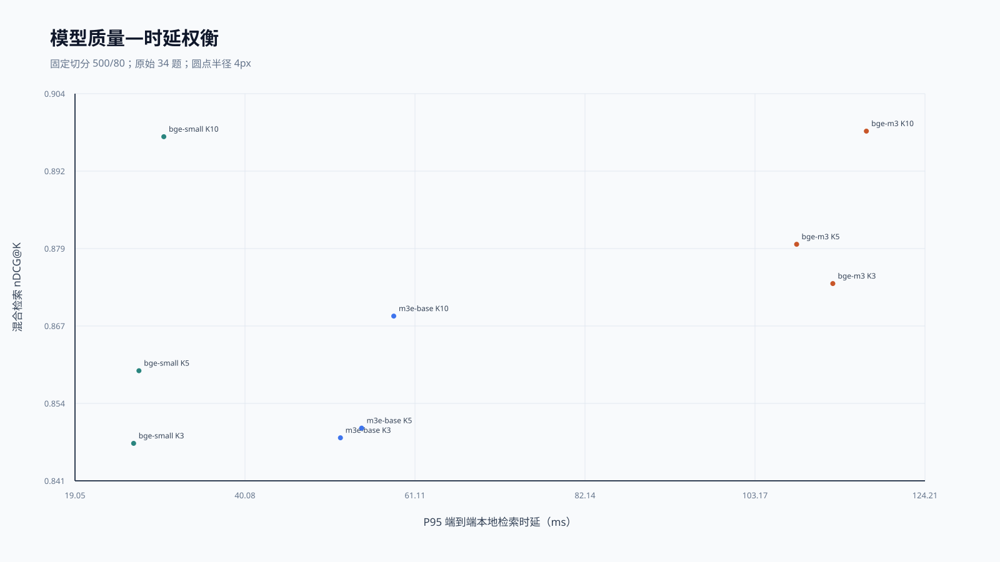
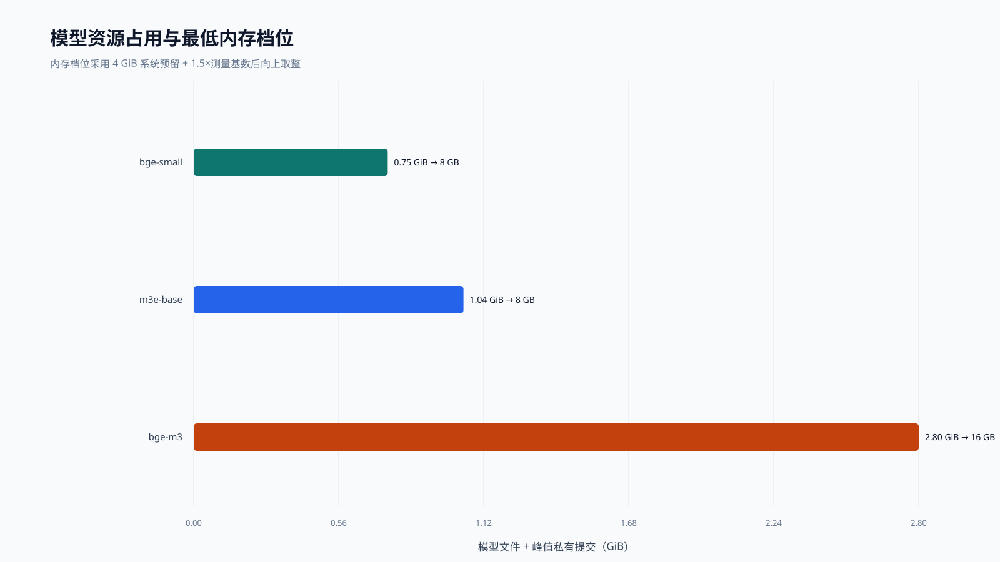
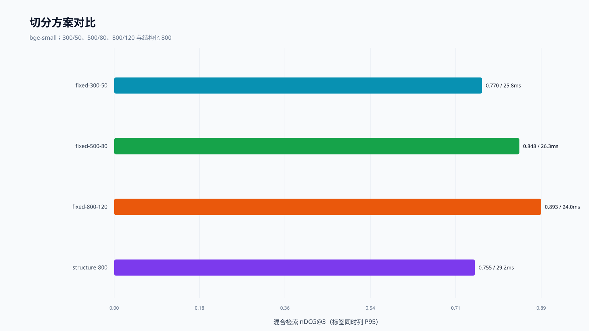
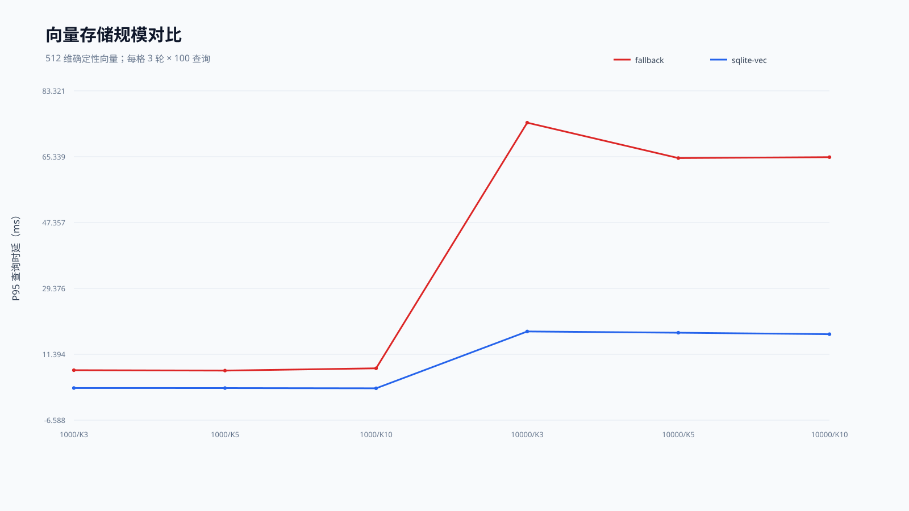
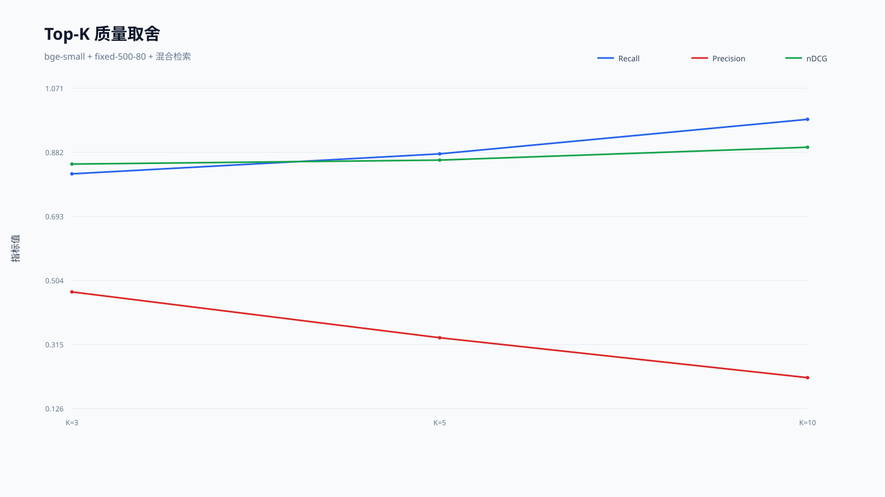
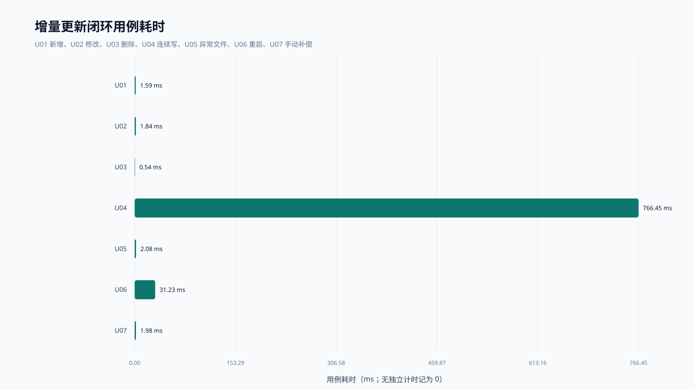
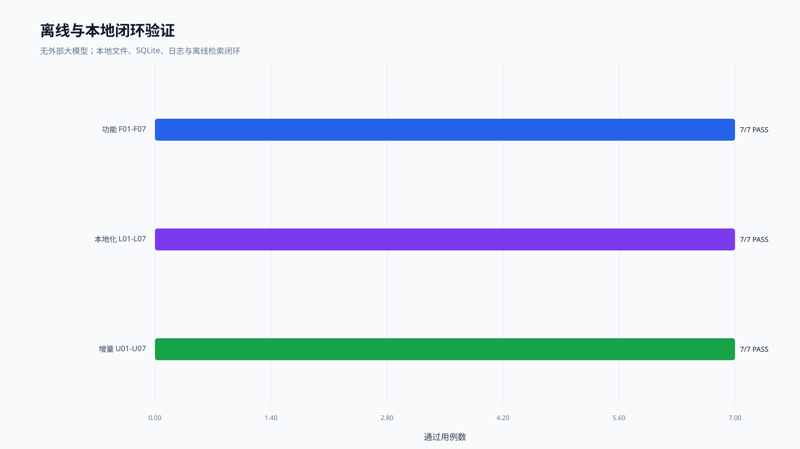
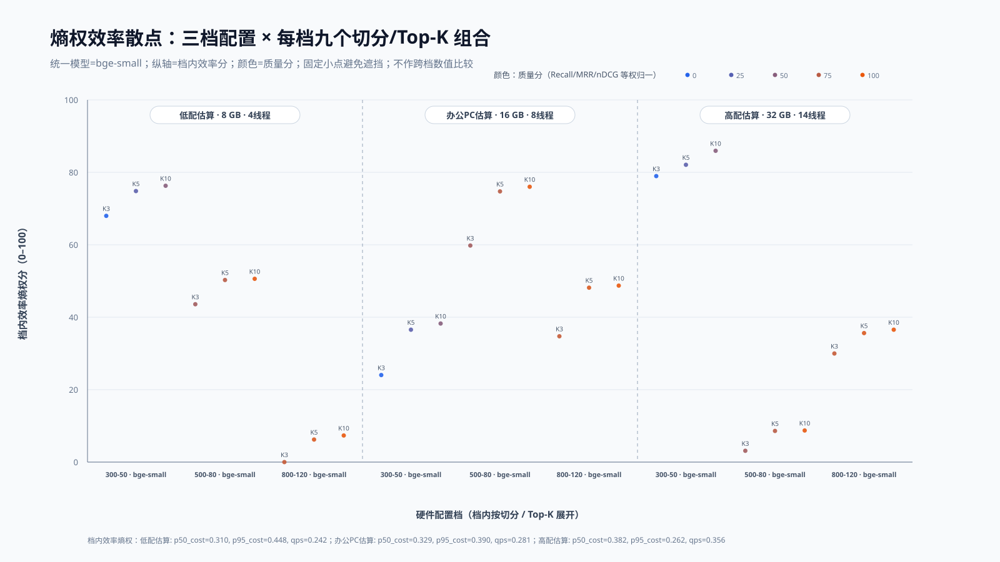

# 端侧知识库技术选型与轻量化验证报告（原始34题重测）

> 结论先行：本轮只使用最初 34 道题；新增 12 篇中文证券语料保留，新增问题不参与测试。推荐默认配置为 **bge-small + fixed-500-80 + Top-K=5 + sqlite-vec**。Hit@3 在部分组合中饱和，必须结合 MRR、Precision、nDCG、MAP 判断。

## 证据口径

- 数据集：`Q1-24docs-34queries-original`，24 篇文档、34 道原始题；题目文件仅 `embedding-test/eval/test_queries.json`（SHA-256 `b40d80c38c8f8af36ede7056c2a4f080445f3949a5403d8b17ba84fe5e3e3508`）。
- 环境：12th Gen Intel(R) Core(TM) i9-12900H，20 逻辑线程，15.74 GiB 内存，Windows-10-10.0.26200-SP0，CPU-only，电源计划“平衡”。
- 完整性：13 个运行结果、0 条错误；检索性能样本 11016 条、质量明细 1224 条；功能用例 21/21 通过。
- 多轮口径：冷启动 5 次；批量嵌入每组 5 次；热检索每个 K 为 3 轮、每轮实际 204 请求；建库 3 次；存储查询每格 3 轮 × 100 次。
- 内存口径：报告保留资源采样时间序列和本轮观测峰值；峰值表示容量风险，不取均值。时间与 QPS 则报告多轮均值及 P50/P95/P99。
- 性能测试顺序执行；每轮数据均保存在来源会话的 `run_result.json`，并由 `manifest.json`/`session_manifest.json` 给出哈希。无外部大模型调用，HTTP 只用于 `127.0.0.1` 本机 Python 嵌入进程通信。

## 一、技术选型调研

Tauri/Rust 负责端侧壳与本地闭环；嵌入模型比较 bge-small、m3e-base、bge-m3；向量存储比较 SQLite 回退扫描与 sqlite-vec。当前小语料下 bge-small 的速度/质量平衡最好，m3e-base 没有形成明显优势，bge-m3 质量略升但成本显著提高。

| 模型 | K | P50 ms | P95 ms | P99 ms | QPS | 样本数 |
|---|---|---|---|---|---|---|
| bge-small | 3 | 22.28 | 26.30 | 39.48 | 43.58 | 612 |
| bge-small | 5 | 23.21 | 26.96 | 39.05 | 41.85 | 612 |
| bge-small | 10 | 24.96 | 30.03 | 44.31 | 38.87 | 612 |
| m3e-base | 3 | 45.51 | 51.88 | 62.13 | 21.72 | 612 |
| m3e-base | 5 | 47.09 | 54.50 | 62.77 | 20.95 | 612 |
| m3e-base | 10 | 47.86 | 58.48 | 66.56 | 20.48 | 612 |
| bge-m3 | 3 | 91.07 | 112.80 | 124.22 | 10.78 | 612 |
| bge-m3 | 5 | 90.57 | 108.32 | 117.78 | 10.96 | 612 |
| bge-m3 | 10 | 95.53 | 116.95 | 136.55 | 10.32 | 612 |

| 模型 | 模式 | K | Hit@K | MRR@K | Recall@K | Precision@K | nDCG@K | MAP@K |
|---|---|---|---|---|---|---|---|---|
| bge-small | 纯向量 | 3 | 1.000 | 0.828 | 0.820 | 0.471 | 0.795 | 0.730 |
| bge-small | 混合 | 3 | 1.000 | 0.907 | 0.819 | 0.471 | 0.848 | 0.799 |
| bge-small | 纯向量 | 5 | 1.000 | 0.828 | 0.859 | 0.312 | 0.788 | 0.715 |
| bge-small | 混合 | 5 | 1.000 | 0.907 | 0.878 | 0.335 | 0.859 | 0.806 |
| bge-small | 纯向量 | 10 | 1.000 | 0.828 | 0.911 | 0.188 | 0.805 | 0.724 |
| bge-small | 混合 | 10 | 1.000 | 0.907 | 0.979 | 0.218 | 0.897 | 0.837 |
| m3e-base | 纯向量 | 3 | 0.912 | 0.799 | 0.735 | 0.441 | 0.734 | 0.671 |
| m3e-base | 混合 | 3 | 1.000 | 0.887 | 0.828 | 0.490 | 0.848 | 0.799 |
| m3e-base | 纯向量 | 5 | 1.000 | 0.820 | 0.875 | 0.312 | 0.766 | 0.679 |
| m3e-base | 混合 | 5 | 1.000 | 0.887 | 0.892 | 0.335 | 0.850 | 0.790 |
| m3e-base | 纯向量 | 10 | 1.000 | 0.820 | 0.903 | 0.171 | 0.772 | 0.683 |
| m3e-base | 混合 | 10 | 1.000 | 0.887 | 0.950 | 0.200 | 0.868 | 0.803 |
| bge-m3 | 纯向量 | 3 | 0.971 | 0.912 | 0.788 | 0.451 | 0.837 | 0.792 |
| bge-m3 | 混合 | 3 | 1.000 | 0.922 | 0.827 | 0.490 | 0.873 | 0.832 |
| bge-m3 | 纯向量 | 5 | 0.971 | 0.912 | 0.833 | 0.306 | 0.836 | 0.787 |
| bge-m3 | 混合 | 5 | 1.000 | 0.922 | 0.892 | 0.341 | 0.880 | 0.829 |
| bge-m3 | 纯向量 | 10 | 1.000 | 0.915 | 0.909 | 0.179 | 0.858 | 0.799 |
| bge-m3 | 混合 | 10 | 1.000 | 0.922 | 0.958 | 0.203 | 0.898 | 0.842 |

### bge-m3 异常核查

bge-m3 健康检查实际报告 1024 维、CPU、14 线程；其 K=3 P95 是 bge-small 的 4.29 倍，建库时间是 13.65 倍。与此同时，混合 nDCG@3 仅从 0.848 升至 0.873。批量吞吐、模型缓存体积、服务端编码耗时与这一趋势一致，未发现错载模型或冷启动样本混入稳态统计；结论是 **真实但性价比不合适**，不是把异常忽略掉。

## 二、轻量性能验证

### 冷启动与批量嵌入

| 模型 | 冷启动P50 ms | 冷启动P95 ms | 首请求P50 ms |
|---|---|---|---|
| bge-small | 6836.42 | 6860.45 | 38.40 |
| m3e-base | 6853.41 | 6857.61 | 84.84 |
| bge-m3 | 8928.98 | 9353.48 | 194.74 |

| 模型 | Batch | P50 ms | P95 ms | texts/s | tokens/s | 样本数 |
|---|---|---|---|---|---|---|
| bge-small | 1 | 23.84 | 25.38 | 42.24 | 2703.67 | 5 |
| bge-small | 8 | 107.37 | 122.98 | 73.66 | 6049.36 | 5 |
| bge-small | 32 | 321.02 | 337.42 | 99.36 | 8308.77 | 5 |
| m3e-base | 1 | 66.98 | 74.97 | 15.18 | 971.66 | 5 |
| m3e-base | 8 | 522.22 | 536.39 | 15.36 | 1261.84 | 5 |
| m3e-base | 32 | 1869.65 | 2273.18 | 16.16 | 1351.06 | 5 |
| bge-m3 | 1 | 193.76 | 231.34 | 5.30 | 249.25 | 5 |
| bge-m3 | 8 | 1423.10 | 1475.58 | 5.62 | 310.60 | 5 |
| bge-m3 | 32 | 5713.59 | 5800.51 | 5.62 | 322.86 | 5 |

### 切分、建库、检索与 QPS

| 切分 | chunk_size | overlap | 块数 | K | 建库均值ms | DB字节 | P95 ms | QPS | Hit | MRR | Recall | Precision | nDCG | MAP |
|---|---|---|---|---|---|---|---|---|---|---|---|---|---|---|
| fixed-300-50 | 300 | 50 | 85 | 3 | 2225.63 | 360448 | 25.76 | 45.51 | 0.971 | 0.833 | 0.744 | 0.490 | 0.770 | 0.715 |
| fixed-300-50 | 300 | 50 | 85 | 5 | 2225.63 | 360448 | 33.15 | 42.34 | 1.000 | 0.839 | 0.859 | 0.365 | 0.807 | 0.736 |
| fixed-300-50 | 300 | 50 | 85 | 10 | 2225.63 | 360448 | 33.23 | 38.95 | 1.000 | 0.839 | 0.955 | 0.229 | 0.839 | 0.760 |
| fixed-500-80 | 500 | 80 | 49 | 3 | 2321.09 | 212992 | 26.30 | 43.58 | 1.000 | 0.907 | 0.819 | 0.471 | 0.848 | 0.799 |
| fixed-500-80 | 500 | 80 | 49 | 5 | 2321.09 | 212992 | 26.96 | 41.85 | 1.000 | 0.907 | 0.878 | 0.335 | 0.859 | 0.806 |
| fixed-500-80 | 500 | 80 | 49 | 10 | 2321.09 | 212992 | 30.03 | 38.87 | 1.000 | 0.907 | 0.979 | 0.218 | 0.897 | 0.837 |
| fixed-800-120 | 800 | 120 | 37 | 3 | 2108.89 | 163840 | 24.04 | 47.61 | 1.000 | 0.907 | 0.864 | 0.529 | 0.893 | 0.855 |
| fixed-800-120 | 800 | 120 | 37 | 5 | 2108.89 | 163840 | 29.46 | 45.31 | 1.000 | 0.907 | 0.922 | 0.376 | 0.901 | 0.859 |
| fixed-800-120 | 800 | 120 | 37 | 10 | 2108.89 | 163840 | 32.12 | 40.88 | 1.000 | 0.907 | 0.975 | 0.221 | 0.903 | 0.852 |
| structure-800 | 800 | 0 | 100 | 3 | 3618.64 | 421888 | 29.21 | 42.02 | 0.882 | 0.789 | 0.737 | 0.382 | 0.755 | 0.719 |
| structure-800 | 800 | 0 | 100 | 5 | 3618.64 | 421888 | 29.00 | 40.56 | 1.000 | 0.826 | 0.880 | 0.294 | 0.813 | 0.753 |
| structure-800 | 800 | 0 | 100 | 10 | 3618.64 | 421888 | 27.73 | 42.75 | 1.000 | 0.826 | 0.922 | 0.168 | 0.819 | 0.749 |

### 向量存储规模

| 后端 | 向量数 | 维度 | K | 插入均值ms | DB字节 | P50 ms | P95 ms | P99 ms | QPS | 样本数 |
|---|---|---|---|---|---|---|---|---|---|---|
| fallback | 1000 | 512 | 3 | 13.73 | 4112384 | 6.103 | 7.051 | 7.397 | 162.21 | 300 |
| fallback | 1000 | 512 | 5 | 13.73 | 4112384 | 6.054 | 6.953 | 7.216 | 163.87 | 300 |
| fallback | 1000 | 512 | 10 | 13.73 | 4112384 | 6.345 | 7.571 | 8.229 | 157.36 | 300 |
| fallback | 10000 | 512 | 3 | 92.60 | 41058304 | 61.843 | 74.620 | 83.370 | 15.92 | 300 |
| fallback | 10000 | 512 | 5 | 92.60 | 41058304 | 59.100 | 64.970 | 67.614 | 16.68 | 300 |
| fallback | 10000 | 512 | 10 | 92.60 | 41058304 | 59.309 | 65.216 | 67.810 | 16.60 | 300 |
| sqlite-vec | 1000 | 512 | 3 | 24.58 | 2150400 | 1.822 | 2.193 | 2.463 | 536.16 | 300 |
| sqlite-vec | 1000 | 512 | 5 | 24.58 | 2150400 | 1.816 | 2.165 | 2.333 | 539.05 | 300 |
| sqlite-vec | 1000 | 512 | 10 | 24.58 | 2150400 | 1.770 | 2.113 | 2.279 | 551.70 | 300 |
| sqlite-vec | 10000 | 512 | 3 | 255.65 | 21266432 | 15.752 | 17.626 | 18.322 | 62.92 | 300 |
| sqlite-vec | 10000 | 512 | 5 | 255.65 | 21266432 | 15.532 | 17.286 | 18.446 | 63.47 | 300 |
| sqlite-vec | 10000 | 512 | 10 | 255.65 | 21266432 | 15.301 | 16.875 | 17.941 | 64.65 | 300 |

两种后端结果重合率 1.000，顺序完全一致率 1.000。10,000 向量时 sqlite-vec 明显优于逐行回退扫描。

### 最低硬件估量

| 模型 | 模型缓存GiB | 峰值私有MiB | 内存基数GiB | 公式需求GiB | 最低标准内存GB | 最低空闲磁盘GB | 实测线程 | CPU口径 |
|---|---|---|---|---|---|---|---|---|
| bge-small | 0.090 | 674.0 | 0.748 | 5.12 | 8 | 1 | 14 | 4线程限额实测 |
| m3e-base | 0.382 | 674.4 | 1.040 | 5.56 | 8 | 1 | 14 | 未在真实低端CPU独立验证 |
| bge-m3 | 2.136 | 675.2 | 2.795 | 8.19 | 16 | 4 | 14 | 未在真实低端CPU独立验证 |

内存公式：`向上取标准档(4 GiB 系统预留 + 1.5 × (模型缓存体积 + 峰值私有提交))`。这是保守估量；Windows 工作集会受裁剪，因此不用偏小的 Working Set 单独给结论。4/8/14 线程数据来自同一台 i9 的线程限额，不等同于三台真实低端机器。

## 三、检索质量验证

Hit@3 全为 1 并非“质量满分”：在 bge-small 500/80 中，纯向量 Hit@3=1.000，但 MRR@3=0.828、Precision@3=0.471、nDCG@3=0.795；混合检索 MRR@3=0.907。原始 34 题多是“公司名＋指标名”的短事实题，前三名命中至少一块很容易饱和；800/120 不是“块大到超过文件长度”，它仍产生 37 个块。结构化 800 反而产生 100 个块且质量更低，证明块数与命中率不是简单单调关系。

本轮严格遵循“只用原始 34 题”，因此不再人为追求 Hit≈0.9；判断配置时以 nDCG/MRR/Precision 的差异为主。

## 四、功能与本地闭环验证

| 用例 | 内容 | 结果 | 耗时ms |
|---|---|---|---|
| F01 | 创建独立知识库 | PASS | 1.37 |
| F02 | 导入文档且数量一致 | PASS | 1.59 |
| F03 | 真实本地模型建立向量索引 | PASS | — |
| F04 | 三类业务语义检索及来源定位 | PASS | — |
| F05 | SQLite索引关闭后可重开 | PASS | — |
| F06 | 未知模型明确报错 | PASS | — |
| F07 | 本地检索结果可组装上下文 | PASS | — |
| L01 | 断网策略下本地模型启动 | PASS | — |
| L02 | 断网策略下导入建库查询 | PASS | — |
| L03 | Sidecar仅绑定loopback | PASS | — |
| L04 | 落盘位置清单 | PASS | — |
| L05 | 日志敏感内容最小化 | PASS | — |
| L06 | 删除知识库后数据库级联清理 | PASS | 0.27 |
| L07 | 模型/外部AI不可用时失败保护 | PASS | — |
| U01 | 新增文档 | PASS | 1.59 |
| U02 | 修改目标文档 | PASS | 1.84 |
| U03 | 删除文档并级联清理 | PASS | 0.54 |
| U04 | 文件监听处理连续状态 | PASS | 766.45 |
| U05 | 损坏文件明确失败且不污染索引 | PASS | 2.08 |
| U06 | 更新后重启恢复 | PASS | 31.23 |
| U07 | 暂停监听后的手动扫描 | PASS | 1.98 |

F01-F07 覆盖知识库、文档导入、真实嵌入、检索、持久化与异常输入；L01-L07 覆盖本地存储、日志脱敏、离线与无外联；U01-U07 覆盖新增、修改、删除、连续写、损坏文件、重启恢复与 watcher 暂停后的手动补偿。

## 五、配置选择结论与后续 AI 对接建议

| 档位 | 建议配置 | 适用判断 |
|---|---|---|
| 轻量最低档 | bge-small；8 GB；至少 4 线程限额；fixed-500-80；K=3；sqlite-vec | 当前 34 题混合 MRR@3 0.907，P95 26.30 ms |
| 典型办公档 | bge-small；16 GB；8 线程；fixed-500-80；K=5；sqlite-vec | 给文档监听、前端与后续问答保留内存余量；检索 Recall 更高 |
| 质量优先档 | bge-m3；16 GB；14 线程级 CPU；fixed-500-80；K=5/10 | 仅在可接受更高延迟和模型占用时采用；本轮质量增益有限 |

后续对接 AI 时只把已验证的本地检索层作为输入接口，单独测生成模型的首 token、吞吐、上下文长度与内存；本报告不包含、也不推断外部大模型性能。

### 熵权辅助图（不作主结论）

| 配置档 | RAM GB | 线程 | 切分 | K | P50 ms | P95 ms | QPS | Recall | MRR | nDCG | 质量分 | 档内效率分 |
|---|---|---|---|---|---|---|---|---|---|---|---|---|
| 低配估算 | 8 | 4 | fixed-300-50 | 3 | 14.09 | 20.54 | 67.48 | 0.744 | 0.833 | 0.770 | 0.0 | 68.0 |
| 低配估算 | 8 | 4 | fixed-300-50 | 5 | 13.94 | 20.39 | 68.35 | 0.859 | 0.839 | 0.807 | 28.3 | 74.8 |
| 低配估算 | 8 | 4 | fixed-300-50 | 10 | 13.90 | 20.36 | 68.40 | 0.955 | 0.839 | 0.839 | 49.8 | 76.3 |
| 低配估算 | 8 | 4 | fixed-500-80 | 3 | 13.21 | 29.41 | 63.27 | 0.819 | 0.907 | 0.848 | 63.3 | 43.6 |
| 低配估算 | 8 | 4 | fixed-500-80 | 5 | 13.05 | 29.27 | 63.90 | 0.878 | 0.907 | 0.859 | 74.6 | 50.3 |
| 低配估算 | 8 | 4 | fixed-500-80 | 10 | 13.04 | 29.26 | 63.93 | 0.979 | 0.907 | 0.897 | 98.5 | 50.6 |
| 低配估算 | 8 | 4 | fixed-800-120 | 3 | 14.17 | 30.87 | 58.97 | 0.864 | 0.907 | 0.893 | 81.1 | 0.0 |
| 低配估算 | 8 | 4 | fixed-800-120 | 5 | 14.01 | 30.76 | 59.48 | 0.922 | 0.907 | 0.901 | 91.2 | 6.2 |
| 低配估算 | 8 | 4 | fixed-800-120 | 10 | 13.97 | 30.76 | 59.53 | 0.975 | 0.907 | 0.903 | 99.4 | 7.3 |
| 办公PC估算 | 16 | 8 | fixed-300-50 | 3 | 14.98 | 28.74 | 61.37 | 0.744 | 0.833 | 0.770 | 0.0 | 24.0 |
| 办公PC估算 | 16 | 8 | fixed-300-50 | 5 | 14.86 | 28.61 | 61.95 | 0.859 | 0.839 | 0.807 | 28.3 | 36.6 |
| 办公PC估算 | 16 | 8 | fixed-300-50 | 10 | 14.82 | 28.60 | 61.87 | 0.955 | 0.839 | 0.839 | 49.8 | 38.3 |
| 办公PC估算 | 16 | 8 | fixed-500-80 | 3 | 15.43 | 20.63 | 63.66 | 0.819 | 0.907 | 0.848 | 63.3 | 59.8 |
| 办公PC估算 | 16 | 8 | fixed-500-80 | 5 | 15.28 | 20.47 | 64.29 | 0.878 | 0.907 | 0.859 | 74.6 | 74.7 |
| 办公PC估算 | 16 | 8 | fixed-500-80 | 10 | 15.27 | 20.46 | 64.35 | 0.979 | 0.907 | 0.897 | 98.5 | 76.0 |
| 办公PC估算 | 16 | 8 | fixed-800-120 | 3 | 15.38 | 23.72 | 62.27 | 0.864 | 0.907 | 0.893 | 81.1 | 34.7 |
| 办公PC估算 | 16 | 8 | fixed-800-120 | 5 | 15.23 | 23.58 | 62.77 | 0.922 | 0.907 | 0.901 | 91.2 | 48.2 |
| 办公PC估算 | 16 | 8 | fixed-800-120 | 10 | 15.22 | 23.56 | 62.77 | 0.975 | 0.907 | 0.903 | 99.4 | 48.7 |
| 高配估算 | 32 | 14 | fixed-300-50 | 3 | 18.73 | 26.58 | 51.62 | 0.744 | 0.833 | 0.770 | 0.0 | 79.0 |
| 高配估算 | 32 | 14 | fixed-300-50 | 5 | 18.73 | 26.42 | 51.94 | 0.859 | 0.839 | 0.807 | 28.3 | 82.1 |
| 高配估算 | 32 | 14 | fixed-300-50 | 10 | 18.54 | 26.43 | 52.05 | 0.955 | 0.839 | 0.839 | 49.8 | 86.0 |
| 高配估算 | 32 | 14 | fixed-500-80 | 3 | 20.53 | 28.69 | 46.76 | 0.819 | 0.907 | 0.848 | 63.3 | 3.1 |
| 高配估算 | 32 | 14 | fixed-500-80 | 5 | 20.38 | 28.51 | 47.04 | 0.878 | 0.907 | 0.859 | 74.6 | 8.6 |
| 高配估算 | 32 | 14 | fixed-500-80 | 10 | 20.40 | 28.50 | 47.08 | 0.979 | 0.907 | 0.897 | 98.5 | 8.7 |
| 高配估算 | 32 | 14 | fixed-800-120 | 3 | 20.71 | 24.02 | 47.47 | 0.864 | 0.907 | 0.893 | 81.1 | 30.0 |
| 高配估算 | 32 | 14 | fixed-800-120 | 5 | 20.56 | 23.85 | 47.79 | 0.922 | 0.907 | 0.901 | 91.2 | 35.6 |
| 高配估算 | 32 | 14 | fixed-800-120 | 10 | 20.53 | 23.83 | 47.84 | 0.975 | 0.907 | 0.903 | 99.4 | 36.5 |

图中所有散点统一使用 **bge-small**；每档出现三个 K10，分别对应 300/50、500/80、800/120 三种切分，并非三个模型。纵轴熵权只使用效率指标 P50、P95、QPS，并在每个档位内部单独计算；颜色质量分使用 min-max 后等权的 Recall、MRR、nDCG。档内权重为 `{"低配估算": {"p50_cost": 0.309975808821443, "p95_cost": 0.44806259891289696, "qps": 0.24196159226566005}, "办公PC估算": {"p50_cost": 0.32921056373622193, "p95_cost": 0.3899147263758173, "qps": 0.2808747098879607}, "高配估算": {"p50_cost": 0.38215059767620974, "p95_cost": 0.26193612148034623, "qps": 0.35591328084344404}}`。每个配置区间正好 9 个小散点（三种切分 × 三个 Top-K），只作辅助聚合，跨档分数不可直接比较。

## 局限与复现

- 原始 34 题只覆盖 12 篇公司研究文档的事实检索；新增证券规则语料扩充了干扰项，但未新增对应问题。因此它不能证明规则问答质量。
- 语料只有 24 篇；存储规模测试使用固定随机向量，只回答向量后端性能与排序一致性，不回答证券语义质量。
- 实机只有当前一台；最低硬件是保守估量与线程限额证据，不是三台物理设备实测。
- 来源会话：`F:\Codex\SecRAG\performance-test-old\performance-test\runs-v2\20260907-formal-34q`。完整逐请求、逐轮、逐用例数据均在该目录，报告聚合数据在 `report_data.json`。
